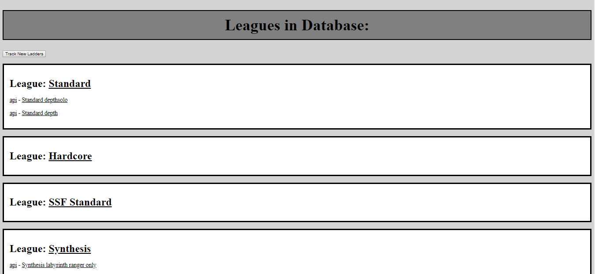
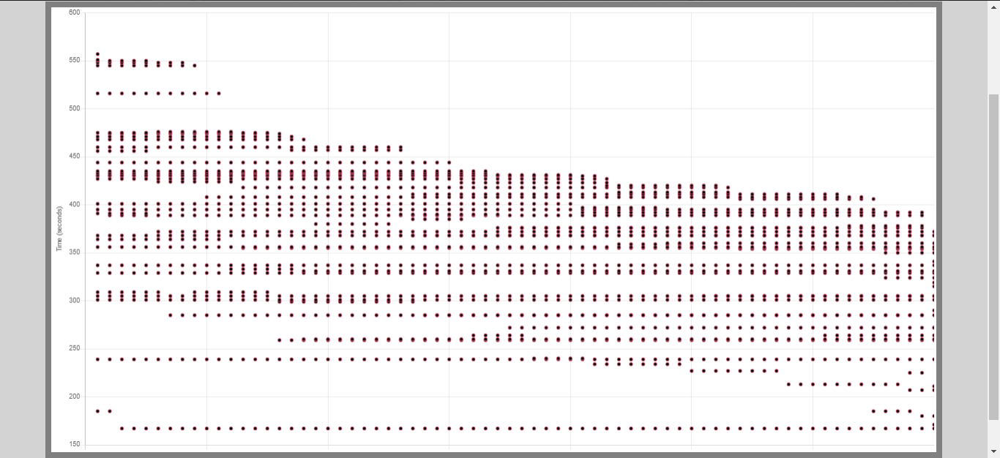
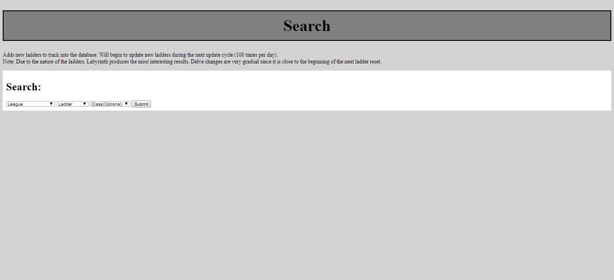

# POE Ladder Tracker

## Overview

The POE Ladder Tracker acquires player information from GGG's official ladder API. Data from the API is saved to a Mongo database which will contain data on the top players on the ladder over a 24-hour time frame. Users can request and flag various ladders to be tracked. When flagging ladders, various filters can be applied: the number of top players to track, classes, etc. Over the 24-hour time frame, real time information will be acquired from the API. The information will be organized into graphs, allowing users to observe trends in the player behaviors.

## Data Model

An Exmaple League:

```javascript
{
  "id": "Standard",
  "ladders": []
}
```
An Exmaple Ladder:

```javascript
{
  "type": "labyrinth",
  "url": "http://api.pathofexile.com/ladders/FAKELEAGUE?type=labyrinth"
  "description":"FAKELEAGUE labyrinth"
  "data": [[1,2,3,4],[1,2,3,4,5],[1,2,3,4,5,6,7]],
  "index": 3 //index is a pointer to the array position for the next data entry, used when updating the data
}
```

## Site map

A [site map](documentation/site-map.png) of how the pages are related to each other. Each edge refers to a reference that redirects the user to the connected pages. The user will begin at the /leagues page.

## Wireframes



/leagues - Shows all current leagues and any ladders currently being tracked belonging to the league



/leagues/ladder/:ladderid - Displays a graph containing all data over a 24-hour time frame



/search - Users may flag new ladders to be tracked

/leagues/ladder/:ladderid/raw - JSON for desired ladder

/leagues/league - JSON for the desired league

## User Stories or Use Cases

1. user views current ladders (and current leagues)
2. user goes to a search page
3. user searches and adds a new ladder (flags the ladder to be tracked)
4. user returns to league page
5. user selects and views various ladders

## [Link to Initial Main Project File](app.js) 

## Annotations / References Used

1. [documentation on Chart.js](https://www.chartjs.org/docs/latest/)
2. [parameters for external javascript](https://stackoverflow.com/questions/2190801/passing-parameters-to-javascript-files)
3. [html and css syntax](https://www.w3schools.com/)
4. [mongoose documentation](https://mongoosejs.com/docs/api.html)
5. [promise usage](https://javascript.info/promise-chaining)